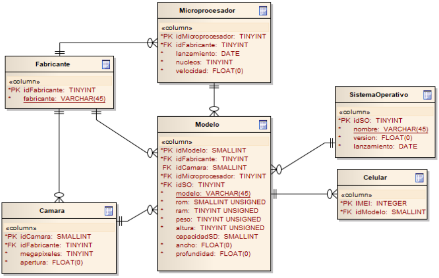
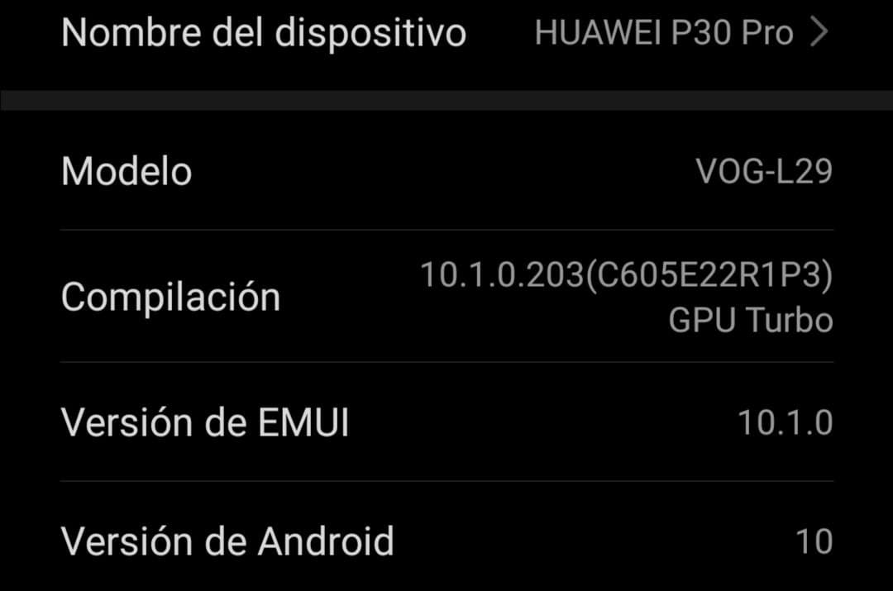

# CellWorldDB

## DER


## Como agregar filas
### Fork del repositorio
### Trabajando en repositorio
Nos fijamos el modelo de nuestro celular en el apartado del mismo que se suele llamar _"Acerca del teléfono"_ 
En mi caso mi celular es el **Huawei P30 Pro VOG-L29**.
Me fijo si mi modelo se encuentra entre los _Inserts_ de la tabla `Modelo`.
```sql
insert into Modelo	(idModelo,idFabricante,idCamara,idMicroprocesador,idSO,modelo,rom,ram,peso,altura,capacidadSD,ancho,profundidad)
            values	(1,1,1,1,1,'A31',128,6,185,159.3,64,73.1,8.6);
```
En mi caso veo que mi modelo no se encuentra (Solo esta el `A31`).
#### ¿Qué hacer si NO se encuentra mi modelo?
Buscamos el modelo de nuestro celular por ejemplo en **[GSMArena](https://www.gsmarena.com)**.
Ya cuando lo encontremos nos va a mostrar información de nuestro teléfono.

1. Fabricantes: Nos fijamos si entre los Inserts de fabricantes se encuentran los fabricantes de nuestros `Modelo`, `Microprocesador`, `Camara`
#### ¿Qué hacer si encuentró mi modelo? (ó ya hice los pasos anteriores)
Queda agregar nuestro celular al DER con el modelo que acabamos de agregar (o que ya estaba). **NO** hay que preocuparse por el IMEI porque este atributo es `AUTO_INCREMENT` (ni se te ocurra poner el tuyo).
```sql
insert into Celular	(idModelo)
		values	(1),
                        (idModeloCorrespondiente);
```
### Pull Request
## Colaboradores

| Año   | División| Participante                                                                | Commit                                                                                                          |
| :---: | :---:   |       :---                                                                  | :---                                                                                                            |
| 2021  | 5° 8°   | Ezequiel Kippes ([@Liono02](https://github.com/Liono02))                    | [218e5db](https://github.com/ET12DE1Computacion/CellWorldDB/commit/218e5db6549ab4a171a5893b74ded67a1c662973)    |
| 2021  | 5° 7°   | Alexis Noguera ([@AlexisNogueraKurt](https://github.com/AlexisNogueraKurt)) | [f8d68c2](https://github.com/ET12DE1Computacion/AGBD-CellWorld/commit/f8d68c2ce261d9a72ec963e94e1ac5c245cbadb8) |